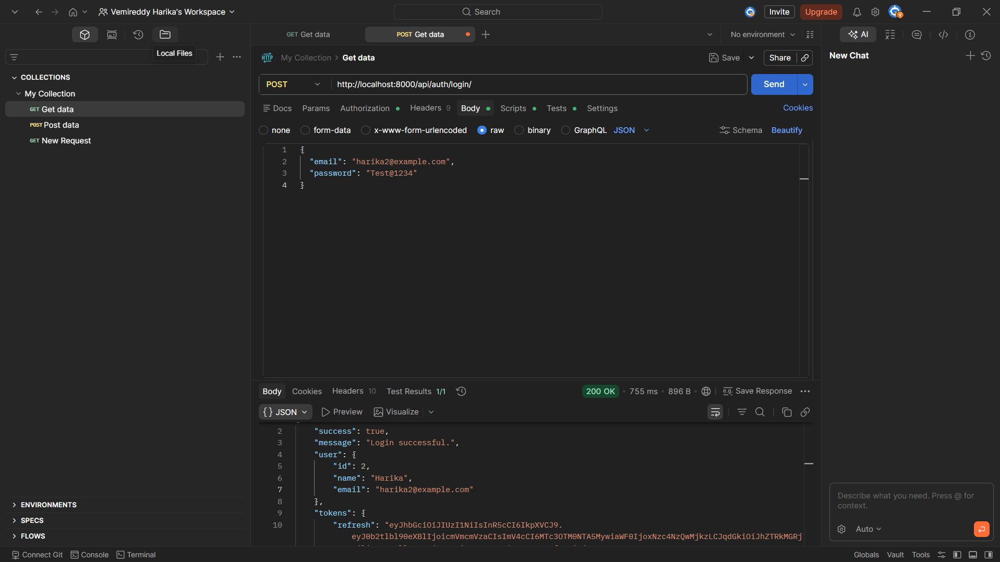
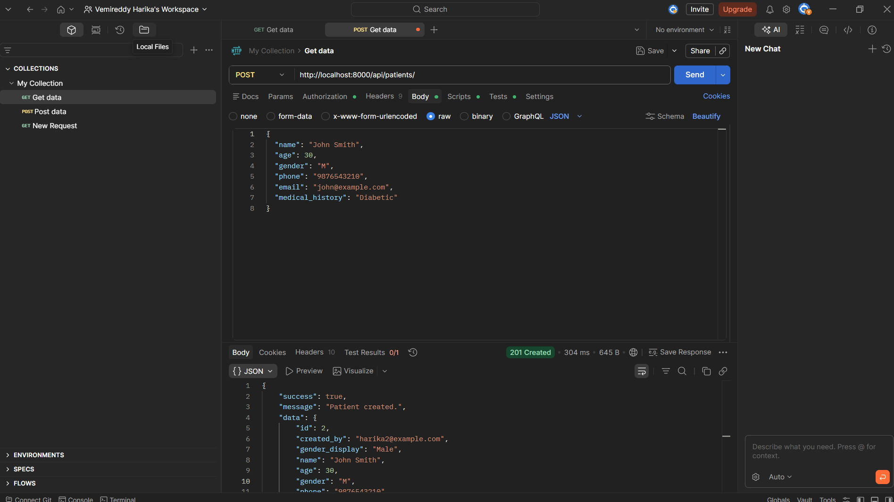
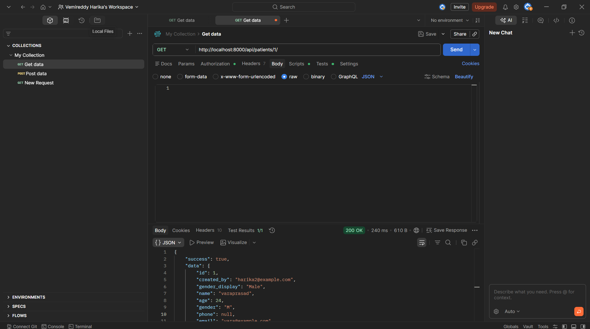
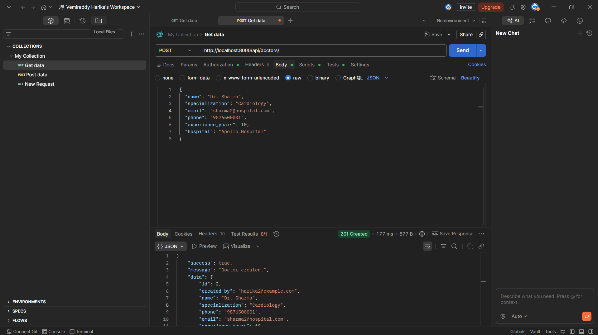
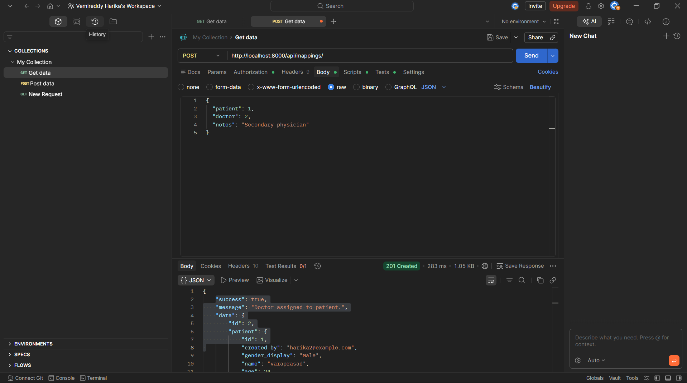

# Healthcare Backend API

A backend system for a healthcare application built with **Django**, **Django REST Framework**, **PostgreSQL**, and **JWT Authentication**.

---

## Tech Stack

| Technology | Version | Purpose |
|---|---|---|
| Django | 5.0.4 | Web framework |
| Django REST Framework | 3.15.1 | REST API builder |
| djangorestframework-simplejwt | 5.3.1 | JWT Authentication |
| PostgreSQL | 15 | Database |
| Gunicorn | 22.0.0 | Production WSGI server |
| Docker + Docker Compose | Latest | Containerization & deployment |

---

## Project Structure

```
healthcare_backend/
├── healthcare_backend/     → Core settings, URLs, exception handler
│   ├── settings.py
│   ├── urls.py
│   └── exception_handler.py
├── authentication/         → Register + Login (JWT)
├── patients/               → Patient CRUD APIs
├── doctors/                → Doctor CRUD APIs
├── mappings/               → Patient-Doctor assignment APIs
├── .env                    → Environment variables (don't commit!)
├── requirements.txt        → Python dependencies
├── Dockerfile              → Docker image config
├── docker-compose.yml      → Multi-container setup
└── .github/workflows/      → GitHub Actions CI/CD pipeline
    └── deploy.yml
```

---

## Quick Start with Docker

### Prerequisites
- Docker Desktop installed and running
- Docker version 20+

### Step 1 — Start the Project

**First time (builds everything):**
```bash
docker-compose up --build
```

**After first time:**
```bash
docker-compose up
```

### Step 2 — Run Migrations (first time only)

Open a new CMD window:
```bash
docker exec -it healthcare_backend-web-1 python manage.py makemigrations patients doctors mappings
docker exec -it healthcare_backend-web-1 python manage.py migrate
```

### Step 3 — API is Live!
```
http://localhost:8000
```

### Stop the Project
```bash
docker-compose down
```

---

## Environment Variables

Edit the `.env` file in the project root:

| Variable | Description | Default |
|---|---|---|
| `SECRET_KEY` | Django secret key | change-in-production |
| `DEBUG` | Debug mode | True |
| `DB_NAME` | PostgreSQL database name | healthcare_db |
| `DB_USER` | PostgreSQL username | postgres |
| `DB_PASSWORD` | PostgreSQL password | yourpassword |
| `DB_HOST` | PostgreSQL host | localhost |
| `DB_PORT` | PostgreSQL port | 5432 |

---

## API Endpoints

### 1. Authentication APIs

| Method | Endpoint | Auth Required | Description |
|---|---|---|---|
| POST | `/api/auth/register/` | No | Register a new user |
| POST | `/api/auth/login/` | No | Login and get JWT token |

### 2. Patient Management APIs

| Method | Endpoint | Auth Required | Description |
|---|---|---|---|
| POST | `/api/patients/` | Yes | Create a new patient |
| GET | `/api/patients/` | Yes | Get all my patients |
| GET | `/api/patients/<id>/` | Yes | Get patient by ID |
| PUT | `/api/patients/<id>/` | Yes | Update patient details |
| DELETE | `/api/patients/<id>/` | Yes | Delete a patient |

### 3. Doctor Management APIs

| Method | Endpoint | Auth Required | Description |
|---|---|---|---|
| POST | `/api/doctors/` | Yes | Create a new doctor |
| GET | `/api/doctors/` | Yes | Get all doctors |
| GET | `/api/doctors/<id>/` | Yes | Get doctor by ID |
| PUT | `/api/doctors/<id>/` | Yes | Update doctor details |
| DELETE | `/api/doctors/<id>/` | Yes | Delete a doctor |

### 4. Patient-Doctor Mapping APIs

| Method | Endpoint | Auth Required | Description |
|---|---|---|---|
| POST | `/api/mappings/` | Yes | Assign doctor to patient |
| GET | `/api/mappings/` | Yes | Get all mappings |
| GET | `/api/mappings/<patient_id>/` | Yes | Get doctors for a patient |
| DELETE | `/api/mappings/delete/<id>/` | Yes | Remove doctor from patient |

---

## Sample API Requests

### Register a User
```
POST http://localhost:8000/api/auth/register/
Content-Type: application/json
```
```json
{
  "name": "Vara Prasad",
  "email": "vara@example.com",
  "password": "SecurePass123!"
}
```

**Response:**
```json
{
  "success": true,
  "message": "User registered successfully.",
  "user": { "id": 1, "name": "Vara Prasad", "email": "vara@example.com" },
  "tokens": { "access": "eyJhbGc...", "refresh": "eyJhbGc..." }
}
```

---

### Login
```
POST http://localhost:8000/api/auth/login/
Content-Type: application/json
```
```json
{
  "email": "vara@example.com",
  "password": "SecurePass123!"
}
```

> Copy the `access` token from the response and use it as `Bearer <token>` in the Authorization header for all protected endpoints.

---

### Create a Patient
```
POST http://localhost:8000/api/patients/
Authorization: Bearer <your_access_token>
Content-Type: application/json
```
```json
{
  "name": "John Smith",
  "age": 30,
  "gender": "M",
  "phone": "9876543210",
  "email": "john@example.com",
  "medical_history": "Diabetic"
}
```

---

### Get All Patients
```
GET http://localhost:8000/api/patients/
Authorization: Bearer <your_access_token>
```

---

### Get Single Patient
```
GET http://localhost:8000/api/patients/1/
Authorization: Bearer <your_access_token>
```

---

### Update Patient
```
PUT http://localhost:8000/api/patients/1/
Authorization: Bearer <your_access_token>
Content-Type: application/json
```
```json
{
  "name": "John Smith Updated",
  "age": 31,
  "medical_history": "Diabetic, Hypertension"
}
```

---

### Delete Patient
```
DELETE http://localhost:8000/api/patients/1/
Authorization: Bearer <your_access_token>
```

---

### Create a Doctor
```
POST http://localhost:8000/api/doctors/
Authorization: Bearer <your_access_token>
Content-Type: application/json
```
```json
{
  "name": "Dr. Sharma",
  "specialization": "Cardiology",
  "email": "sharma@hospital.com",
  "phone": "9876500001",
  "experience_years": 10,
  "hospital": "Apollo Hospital"
}
```

---

### Get All Doctors
```
GET http://localhost:8000/api/doctors/
Authorization: Bearer <your_access_token>
```

---

### Get Single Doctor
```
GET http://localhost:8000/api/doctors/1/
Authorization: Bearer <your_access_token>
```

---

### Update Doctor
```
PUT http://localhost:8000/api/doctors/1/
Authorization: Bearer <your_access_token>
Content-Type: application/json
```
```json
{
  "name": "Dr. Sharma Updated",
  "specialization": "Neurology",
  "experience_years": 12
}
```

---

### Delete Doctor
```
DELETE http://localhost:8000/api/doctors/1/
Authorization: Bearer <your_access_token>
```

---

### Assign Doctor to Patient
```
POST http://localhost:8000/api/mappings/
Authorization: Bearer <your_access_token>
Content-Type: application/json
```
```json
{
  "patient": 1,
  "doctor": 1,
  "notes": "Primary care physician"
}
```

---

### Get All Mappings
```
GET http://localhost:8000/api/mappings/
Authorization: Bearer <your_access_token>
```

---

### Get Doctors for a Specific Patient
```
GET http://localhost:8000/api/mappings/1/
Authorization: Bearer <your_access_token>
```

---

### Remove Doctor from Patient
```
DELETE http://localhost:8000/api/mappings/delete/1/
Authorization: Bearer <your_access_token>
```

---

## Recommended Testing Order in Postman

1. `POST /api/auth/register/` — Register user
2. `POST /api/auth/login/` — Login, copy access token
3. `POST /api/patients/` — Create patient (note the `id`)
4. `POST /api/doctors/` — Create doctor (note the `id`)
5. `GET /api/patients/` — List all patients
6. `GET /api/patients/1/` — Get single patient
7. `PUT /api/patients/1/` — Update patient
8. `GET /api/doctors/` — List all doctors
9. `GET /api/doctors/1/` — Get single doctor
10. `PUT /api/doctors/1/` — Update doctor
11. `POST /api/mappings/` — Assign doctor to patient
12. `GET /api/mappings/` — List all mappings
13. `GET /api/mappings/1/` — Get doctors for patient
14. `DELETE /api/mappings/delete/1/` — Remove mapping
15. `DELETE /api/patients/1/` — Delete patient
16. `DELETE /api/doctors/1/` — Delete doctor

---

## Common Issues & Fixes

| Problem | Fix |
|---|---|
| Port 8000 already in use | Change `"8000:8000"` to `"8001:8000"` in docker-compose.yml |
| Docker not running | Open Docker Desktop, wait for whale icon in system tray |
| DB connection error | Wait 10 sec after `docker-compose up`, DB takes time to start |
| Virtualization not detected | Enable VT-x / Intel Virtualization in BIOS |
| 401 Unauthorized | Add `Authorization: Bearer <token>` header in Postman |
| 404 on `localhost:8000/` | Normal — no homepage. Use `/api/auth/register/` etc. |

---

## Gender Field Values

| Value | Meaning |
|---|---|
| `M` | Male |
| `F` | Female |
| `O` | Other |

---

*Healthcare Backend API — Django Assignment*

## API Screenshots

### ?? Login


### ?? Add Patient


### ?? Get Patient by ID


### ????? Add Doctor


### ?? Assign Doctor to Patient


## API Screenshots

### ?? Login


### ?? Add Patient


### ?? Get Patient by ID


### ????? Add Doctor


### ?? Assign Doctor to Patient

